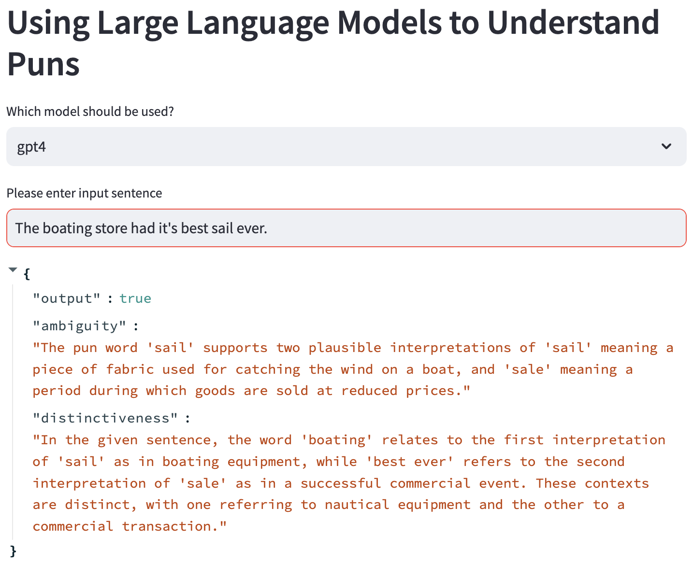

# PUNderstand 😂

> Using Large Language Models to
> Understand Puns

Course project for CNIT 483 - Applied Machine Learning (Fall 2023)

### Setup

> These instructions are for macOS running Apple Silicon

> Make sure you have Python 3.9 and above

1. Clone the repository

```sh
git clone https://github.com/RyanDsilva/punderstand.git
```

2. Download a quantized model to the local folder `models`. Make sure it is in the `.gguf` format.
   I used the `mistral-7b-openocra.Q6_K` from this [link](https://huggingface.co/TheBloke/Mistral-7B-OpenOrca-GGUF).

3. Install python dependencies

```sh
pip install -r requirements.txt
```

4. Install `llama.cpp` for Apple Silicon

```sh
CMAKE_ARGS="-DLLAMA_METAL=on" pip install llama-cpp-python
```

5. Get your Open AI API key and store it in the `.env` file

```sh
OPEN_API_KEY=''
```

6. To run the UI:

```sh
sh run.sh
```

7. To reproduce results, run the `.ipynb` notebook files.

### Demo Application


